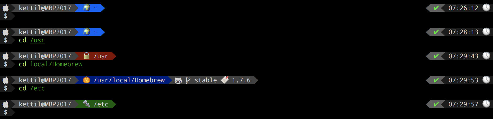

# Dotfiles 🎃

My dotfiles library



## 🎯 Install

```bash
git clone https://github.com/kettil/dotfiles ~/.dotfiles

# on mac
xcode-select --install

# command for install and update
cd ~/.dotfiles && ./setup.sh
```

The font of the terminal must be `Droid+Sans+Mono+Awesome.ttf`

All scripts/bin folders are defined in the variable \$PATH.

### Adaptation of zsh

It is possible to customize the zshrc per pre/post files.

- `~/.zshrc_pre.zsh` - Is called before the initiation of `oh-my-zsh`
- `~/.zshrc_post.zsh` - Is called at the end

## ⛄ Dotfiles

All static dotfiles are stored in the [./configs](./configs) folder. Via `./setup.sh` the files are linked to the home directory. The folder structure of configs is kept in the home directory.

## 🗺 Aliases

The following aliases are defined:

- `mkcdir` - create a folder and calls upon this
- `code` - starts **Visual Basic Code**, if installed (only mac)
- `ios` - starts **iOS Simulator**, if **xCode** is installed (only mac)
- `fileMerge` - starts **FileMerge** simulator, if **xCode** is installed (only mac)
- `server-8080` - start a web server in the current order, if **docker** is installed

## 👽 Scripts

List of all scripts in [./bin](./bin).

- `color-table.sh` - showed a color table in the shell (with color codes)
- `sleeps` - sleeps is an extension of `sleep` with a visual representation of the waiting time

## 👻 Homebrew

[Homebrew](https://brew.sh) is a package manager for macOS.

The following scripts are installed:

| Category     | Packages                                                         |
| ------------ | ---------------------------------------------------------------- |
| Application  | hex-fiend                                                        |
| Development  | nodejs, docker, helm, postman                                    |
| Fuse         | osxfuse, sshfs                                                   |
| Monitoring   | htop, iftop                                                      |
| Networking   | fping, nmap, speedtest-cli                                       |
| PDF          | gs, qpdf                                                         |
| Shell        | zsh                                                              |
| System Tools | f3, git, nano, p7zip, tree, unrar, wget, gnupg, jq, fzf, fd, bat |
| Videos       | atomicparsley, ffmpeg, mkvtoolnix, mp4v2, youtube-dl             |

### Scripts

List of all scripts in [./brew-bin](./brew-bin).

- `flash-check.sh` - checks flash memory cards for their size (e.g. `flash-check.sh /path/to/flashcard`). The flash memory card should be empty.
- `pdf-merged.sh` - merges many PDF files into one (e.g. `pdf-merged.sh 1.pdf 2.pdf`).
- `pdf-smaller.sh` - reduce the size of a PDF, if possible (e.g. `pdf-smaller.sh 1.pdf`).

## 💥 Docker

The container files are in [./docker](./docker) and the associated scripts in [./docker-bin](./docker-bin).
When a script is called and the container does not exist, it is automatically built.

Containers can be created and deleted manually:

- dotfiles-docker-build-\<container name\> (e.g. `dotfiles-docker-build-latex`)
- dotfiles-docker-rm-\<container name\> (e.g. `dotfiles-docker-rm-latex`)

You can also create or delete all containers at once:

- dotfiles-docker-all-build
- dotfiles-docker-all-rm

### Containers (with scripts)

- **hadolint** - a Dockerfile linter
  - `hadolint`
- **LaTeX** - a container with texlive.
  - `pdflatex`
  - `xelatex`
- **Pandoc** - a container with pandoc.
  - `pandoc`
  - `pandoc-pdf` (uses the LaTeX container)
  - `pandoc-letter` (uses the LaTeX container)

### Script: pandoc-letter

Create a german DIN 676 letter from a markdown file.
The LaTeX template for the letter is located at [pandoc/templates/letter.latex](pandoc/templates/letter.latex).

In folder [example/pandoc-pdf](example/pandoc-pdf) is an example.
The script `pandoc-letter letter.md` must be called in this folder.

### Script: pandoc-pdf

Converts a Markdown file to a PDF file.
The template [Eisvogel](https://github.com/Wandmalfarbe/pandoc-latex-template) is used.

## 📡 Kubernetes

If `kubectl` is installed, then the following tools are installed additionally.

- [kubectx](https://github.com/ahmetb/kubectx#kubectx1)
- [kubens](https://github.com/ahmetb/kubectx#kubens1)
